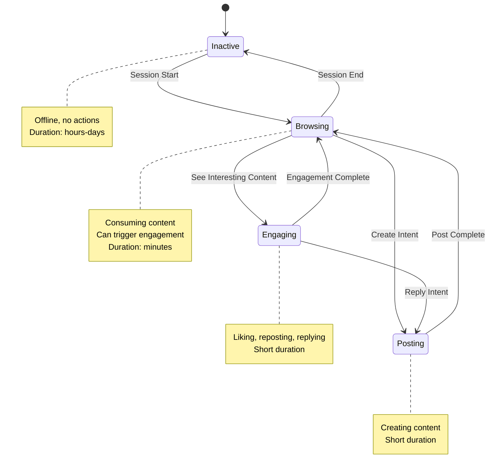

# Agent Behavior Model Specification

This document defines the comprehensive behavioral models for simulated agents in SocialSim. These models determine how agents interact, create content, and evolve within the social network simulation.

## Overview

Agent behavior in SocialSim is modeled using a multi-layered approach:

```
┌─────────────────────────────────────────────────────────────────────┐
│                        Agent Behavior System                         │
├─────────────────────────────────────────────────────────────────────┤
│                                                                      │
│  ┌──────────────────┐   ┌──────────────────┐   ┌──────────────────┐│
│  │   Personality    │   │    Activity      │   │     Content      ││
│  │     Traits       │   │    Patterns      │   │   Preferences    ││
│  │                  │   │                  │   │                  ││
│  │ • Big Five       │   │ • Time-of-day    │   │ • Topic weights  ││
│  │ • Opinion        │   │ • Day-of-week    │   │ • Media types    ││
│  │ • Sentiment      │   │ • Frequency      │   │ • Content length ││
│  └────────┬─────────┘   └────────┬─────────┘   └────────┬─────────┘│
│           │                      │                      │          │
│           └──────────────────────┼──────────────────────┘          │
│                                  ▼                                  │
│  ┌──────────────────────────────────────────────────────────────┐  │
│  │                    Decision Engine                            │  │
│  │                                                                │  │
│  │  Probability distributions + trait modifiers = agent actions  │  │
│  └──────────────────────────────────────────────────────────────┘  │
│                                  │                                  │
│           ┌──────────────────────┼──────────────────────┐          │
│           │                      │                      │          │
│  ┌────────▼─────────┐   ┌────────▼─────────┐   ┌────────▼─────────┐│
│  │  Social Behavior │   │    Influence     │   │    Temporal      ││
│  │                  │   │  Susceptibility  │   │    Evolution     ││
│  │ • Follow/unfollow│   │ • Trend adoption │   │ • Opinion drift  ││
│  │ • Engagement     │   │ • Echo chamber   │   │ • Trait decay    ││
│  │ • Reciprocity    │   │ • Resistance     │   │ • Learning       ││
│  └──────────────────┘   └──────────────────┘   └──────────────────┘│
│                                                                      │
└─────────────────────────────────────────────────────────────────────┘
```

## Design Principles

1. **Probabilistic Behaviors**: All agent actions are probabilistic, not deterministic
2. **Reproducibility**: Same random seed + configuration = identical simulation
3. **Configurability**: All parameters externally configurable without code changes
4. **Observability**: Every decision point is loggable for analysis
5. **Performance**: O(1) decision making per agent per tick for 100K+ agents
6. **Extensibility**: Plugin-style behavior modules for custom agent types

---

## 1. Personality Traits

### 1.1 Big Five Model (OCEAN)

The Big Five personality model provides a psychologically-validated foundation for agent behavior. Each trait is represented as a continuous value from 0.0 to 1.0.

```csharp
public class BigFivePersonality
{
    /// <summary>
    /// Openness to Experience (0.0-1.0)
    /// High: Creative, curious, diverse interests, receptive to new ideas
    /// Low: Conventional, practical, prefer routine, resistant to change
    /// </summary>
    public double Openness { get; set; }
    
    /// <summary>
    /// Conscientiousness (0.0-1.0)
    /// High: Organized, dependable, self-disciplined, achievement-oriented
    /// Low: Impulsive, careless, flexible, spontaneous
    /// </summary>
    public double Conscientiousness { get; set; }
    
    /// <summary>
    /// Extraversion (0.0-1.0)
    /// High: Outgoing, energetic, seeks social interaction, talkative
    /// Low: Reserved, solitary, prefers small groups, reflective
    /// </summary>
    public double Extraversion { get; set; }
    
    /// <summary>
    /// Agreeableness (0.0-1.0)
    /// High: Cooperative, trusting, helpful, empathetic
    /// Low: Competitive, skeptical, challenging, direct
    /// </summary>
    public double Agreeableness { get; set; }
    
    /// <summary>
    /// Neuroticism (0.0-1.0) 
    /// High: Emotionally reactive, anxious, mood swings, sensitive
    /// Low: Emotionally stable, calm, resilient, secure
    /// </summary>
    public double Neuroticism { get; set; }
}
```

#### Behavioral Implications

| Trait | High Value Effect | Low Value Effect |
|-------|-------------------|------------------|
| **Openness** | Diverse topic interests, early trend adoption, creative content | Narrow interests, late adoption, conventional posts |
| **Conscientiousness** | Regular posting schedule, complete profile, quality content | Irregular posting, incomplete profile, casual content |
| **Extraversion** | High posting frequency, many follows, active engagement | Lurking behavior, few connections, selective engagement |
| **Agreeableness** | High follow-back rate, positive sentiment, supportive comments | Low reciprocity, critical content, confrontational replies |
| **Neuroticism** | Sentiment volatility, reactive to negative content, drama participation | Stable sentiment, ignores negativity, conflict avoidance |

#### Trait Correlations (Realistic Distributions)

Real-world Big Five traits are slightly correlated. Default correlation matrix:

```json
{
  "correlations": {
    "O-C": 0.15,   // Openness-Conscientiousness
    "O-E": 0.25,   // Openness-Extraversion
    "O-A": 0.12,   // Openness-Agreeableness
    "O-N": -0.10,  // Openness-Neuroticism
    "C-E": 0.15,   // Conscientiousness-Extraversion
    "C-A": 0.20,   // Conscientiousness-Agreeableness
    "C-N": -0.30,  // Conscientiousness-Neuroticism
    "E-A": 0.20,   // Extraversion-Agreeableness
    "E-N": -0.20,  // Extraversion-Neuroticism
    "A-N": -0.35   // Agreeableness-Neuroticism
  }
}
```

### 1.2 Opinion/Political Spectrum

For opinion dynamics simulations, agents have positions on configurable opinion dimensions.

```csharp
public class OpinionProfile
{
    /// <summary>
    /// Named opinion dimensions with positions (-1.0 to 1.0)
    /// Dimension names are configurable per simulation
    /// </summary>
    public Dictionary<string, double> Positions { get; set; }
    
    /// <summary>
    /// Confidence in each opinion (0.0-1.0)
    /// High confidence = harder to change, more likely to express
    /// </summary>
    public Dictionary<string, double> Confidence { get; set; }
    
    /// <summary>
    /// How strongly this agent expresses opinions (0.0-1.0)
    /// High = posts contain explicit opinion signals
    /// Low = neutral, informational content
    /// </summary>
    public double ExpressionIntensity { get; set; }
    
    /// <summary>
    /// Willingness to engage with opposing views (0.0-1.0)
    /// High = debates with opposite opinions
    /// Low = only engages with similar opinions (echo chamber)
    /// </summary>
    public double OppositionTolerance { get; set; }
}
```

#### Example Opinion Dimensions

```json
{
  "dimensions": [
    {
      "name": "TechOptimism",
      "description": "Attitude toward technology and AI",
      "poles": ["Tech-skeptic (-1)", "Tech-optimist (+1)"]
    },
    {
      "name": "EnvironmentPriority",
      "description": "Environmental vs economic priority",
      "poles": ["Economy-first (-1)", "Environment-first (+1)"]
    },
    {
      "name": "SocialTrust",
      "description": "Trust in institutions and other people",
      "poles": ["Low trust (-1)", "High trust (+1)"]
    }
  ]
}
```

### 1.3 Sentiment Bias

Base sentiment tendency affects content generation and reactions.

```csharp
public class SentimentProfile
{
    /// <summary>
    /// Base sentiment bias (-1.0 to 1.0)
    /// -1.0 = strongly negative tendency
    /// +1.0 = strongly positive tendency
    /// 0.0 = neutral/balanced
    /// </summary>
    public double BaseSentiment { get; set; }
    
    /// <summary>
    /// Sentiment volatility (0.0-1.0)
    /// How much sentiment varies from base
    /// High = emotional swings, reactive to events
    /// Low = consistent sentiment regardless of context
    /// </summary>
    public double Volatility { get; set; }
    
    /// <summary>
    /// Sentiment recovery rate (0.0-1.0)
    /// How quickly sentiment returns to base after perturbation
    /// High = bounces back quickly
    /// Low = sentiment shifts persist
    /// </summary>
    public double RecoveryRate { get; set; }
    
    /// <summary>
    /// Current sentiment state (computed, not configured)
    /// </summary>
    public double CurrentSentiment { get; set; }
}
```

---

## 2. Activity Patterns

### 2.1 Time-of-Day Distribution

Agents have probabilistic activity patterns throughout the day.

```csharp
public class ActivityPattern
{
    /// <summary>
    /// Activity probability by hour (0-23), values 0.0-1.0
    /// Represents relative activity likelihood, not absolute
    /// </summary>
    public double[] HourlyActivity { get; set; } // 24 values
    
    /// <summary>
    /// Agent's timezone offset from UTC in hours
    /// </summary>
    public int TimezoneOffsetHours { get; set; }
    
    /// <summary>
    /// Activity multiplier for each day of week (0=Sunday, 6=Saturday)
    /// </summary>
    public double[] DayOfWeekMultiplier { get; set; } // 7 values
    
    /// <summary>
    /// Session behavior configuration
    /// </summary>
    public SessionBehavior SessionBehavior { get; set; }
}

public class SessionBehavior
{
    /// <summary>
    /// Average number of sessions per day
    /// </summary>
    public double SessionsPerDay { get; set; }
    
    /// <summary>
    /// Average session duration in minutes
    /// </summary>
    public double AverageSessionMinutes { get; set; }
    
    /// <summary>
    /// Standard deviation of session duration
    /// </summary>
    public double SessionDurationStdDev { get; set; }
    
    /// <summary>
    /// Actions per session (posts, likes, follows, etc.)
    /// </summary>
    public double ActionsPerSession { get; set; }
}
```

#### Predefined Activity Archetypes

```json
{
  "archetypes": {
    "MorningPerson": {
      "hourlyActivity": [0.0, 0.0, 0.0, 0.0, 0.1, 0.3, 0.7, 0.9, 1.0, 0.9, 0.7, 0.5, 0.4, 0.3, 0.2, 0.2, 0.1, 0.1, 0.1, 0.0, 0.0, 0.0, 0.0, 0.0],
      "peakHours": [7, 8, 9],
      "description": "Most active early morning, tapers through day"
    },
    "NightOwl": {
      "hourlyActivity": [0.3, 0.2, 0.1, 0.0, 0.0, 0.0, 0.0, 0.1, 0.2, 0.3, 0.4, 0.5, 0.5, 0.6, 0.6, 0.7, 0.8, 0.9, 1.0, 1.0, 0.9, 0.8, 0.6, 0.4],
      "peakHours": [18, 19, 20, 21],
      "description": "Most active evening to late night"
    },
    "WorkHours": {
      "hourlyActivity": [0.0, 0.0, 0.0, 0.0, 0.0, 0.0, 0.1, 0.2, 0.5, 0.8, 0.9, 0.7, 0.5, 0.8, 0.9, 0.8, 0.6, 0.3, 0.1, 0.0, 0.0, 0.0, 0.0, 0.0],
      "peakHours": [9, 10, 14, 15],
      "description": "Active during business hours with lunch dip"
    },
    "AlwaysOn": {
      "hourlyActivity": [0.5, 0.5, 0.5, 0.4, 0.4, 0.5, 0.6, 0.7, 0.8, 0.9, 0.9, 0.9, 0.8, 0.9, 0.9, 0.9, 0.9, 0.9, 0.9, 0.8, 0.7, 0.6, 0.5, 0.5],
      "peakHours": [9, 10, 11, 14, 15, 16, 17, 18],
      "description": "High activity most of day, slight overnight dip"
    }
  }
}
```

### 2.2 Posting Frequency Distribution

How often agents create original content, using configurable statistical distributions.

```csharp
public class PostingFrequency
{
    /// <summary>
    /// Distribution type for inter-post intervals
    /// </summary>
    public FrequencyDistribution Distribution { get; set; }
    
    /// <summary>
    /// Mean posts per day (used with Poisson)
    /// </summary>
    public double MeanPostsPerDay { get; set; }
    
    /// <summary>
    /// Burst probability (used with BurstyPoisson)
    /// Probability of entering burst mode
    /// </summary>
    public double BurstProbability { get; set; }
    
    /// <summary>
    /// Burst multiplier (used with BurstyPoisson)
    /// How much more frequent posts are during burst
    /// </summary>
    public double BurstMultiplier { get; set; }
    
    /// <summary>
    /// Minimum interval between posts in minutes
    /// Prevents unrealistic rapid-fire posting
    /// </summary>
    public int MinIntervalMinutes { get; set; }
}

public enum FrequencyDistribution
{
    /// <summary>
    /// Standard Poisson process - random, independent events
    /// Good for casual users
    /// </summary>
    Poisson,
    
    /// <summary>
    /// Poisson with occasional bursts
    /// Good for news commentators, live-tweeters
    /// </summary>
    BurstyPoisson,
    
    /// <summary>
    /// Scheduled/regular intervals with noise
    /// Good for content creators, brands
    /// </summary>
    Scheduled,
    
    /// <summary>
    /// Heavy-tailed distribution (power law)
    /// Long quiet periods with occasional activity
    /// Good for lurkers who occasionally post
    /// </summary>
    HeavyTailed
}
```

### 2.3 Activity State Machine

Agents transition between activity states affecting all behaviors.



---

## 3. Content Preferences

### 3.1 Topic Interests

Weighted topic preferences drive content generation and engagement.

```csharp
public class ContentPreferences
{
    /// <summary>
    /// Topic interests with weights (0.0-1.0)
    /// Weights determine content generation and engagement likelihood
    /// </summary>
    public Dictionary<string, double> TopicWeights { get; set; }
    
    /// <summary>
    /// How diverse content is (0.0-1.0)
    /// High = posts about many topics
    /// Low = focused on top interests only
    /// </summary>
    public double TopicDiversity { get; set; }
    
    /// <summary>
    /// Willingness to engage with off-topic content (0.0-1.0)
    /// </summary>
    public double OffTopicEngagement { get; set; }
    
    /// <summary>
    /// Topic interest evolution rate (0.0-1.0)
    /// How quickly interests change based on network influence
    /// </summary>
    public double InterestEvolutionRate { get; set; }
}
```

#### Standard Topic Taxonomy

```json
{
  "topicHierarchy": {
    "Technology": {
      "subtopics": ["AI", "Programming", "Gadgets", "Cybersecurity", "Web3", "Gaming"],
      "defaultWeight": 0.15
    },
    "Politics": {
      "subtopics": ["Elections", "Policy", "International", "LocalGov"],
      "defaultWeight": 0.10
    },
    "Entertainment": {
      "subtopics": ["Movies", "Music", "TV", "Celebrities", "Books"],
      "defaultWeight": 0.20
    },
    "Sports": {
      "subtopics": ["Football", "Basketball", "Soccer", "Olympics", "Esports"],
      "defaultWeight": 0.12
    },
    "Science": {
      "subtopics": ["Space", "Biology", "Physics", "Climate", "Medicine"],
      "defaultWeight": 0.08
    },
    "Lifestyle": {
      "subtopics": ["Food", "Travel", "Fashion", "Fitness", "DIY"],
      "defaultWeight": 0.15
    },
    "Business": {
      "subtopics": ["Startups", "Finance", "Crypto", "Markets", "Careers"],
      "defaultWeight": 0.10
    },
    "Social": {
      "subtopics": ["Memes", "Humor", "Relationships", "Parenting"],
      "defaultWeight": 0.10
    }
  }
}
```

### 3.2 Media Type Preferences

Preference for different content formats.

```csharp
public class MediaPreferences
{
    /// <summary>
    /// Preference weights for media types (should sum to 1.0)
    /// </summary>
    public Dictionary<MediaType, double> TypeWeights { get; set; }
    
    /// <summary>
    /// For image posts, preference for image count (1-4)
    /// </summary>
    public int PreferredImageCount { get; set; }
    
    /// <summary>
    /// Whether to prefer original media or reposts
    /// </summary>
    public double OriginalMediaPreference { get; set; }
}

public enum MediaType
{
    TextOnly,       // Pure text posts
    TextWithImage,  // Text with attached images
    TextWithVideo,  // Text with video
    TextWithLink,   // Text with link preview
    ImageOnly,      // Images with minimal text
    Poll            // Poll/survey posts
}
```

### 3.3 Content Length Preferences

```csharp
public class ContentLengthPreferences
{
    /// <summary>
    /// Distribution of post lengths
    /// </summary>
    public LengthDistribution Distribution { get; set; }
    
    /// <summary>
    /// Preferred post length in characters
    /// </summary>
    public int PreferredLength { get; set; }
    
    /// <summary>
    /// Standard deviation of length (for normal distribution)
    /// </summary>
    public int LengthStdDev { get; set; }
    
    /// <summary>
    /// Minimum post length
    /// </summary>
    public int MinLength { get; set; }
    
    /// <summary>
    /// Maximum post length (platform limit)
    /// </summary>
    public int MaxLength { get; set; }
}

public enum LengthDistribution
{
    Short,      // Mostly brief posts (< 100 chars)
    Medium,     // Mixed length (100-200 chars)
    Long,       // Tends toward longer posts (200-300 chars)
    Variable,   // Wide distribution based on content
    MaxLength   // Uses full character limit
}
```

### 3.4 Language and Tone

```csharp
public class LanguageTone
{
    /// <summary>
    /// Formality level (0.0-1.0)
    /// Low = casual, slang, abbreviations
    /// High = formal, complete sentences
    /// </summary>
    public double Formality { get; set; }
    
    /// <summary>
    /// Emoji usage frequency (0.0-1.0)
    /// </summary>
    public double EmojiFrequency { get; set; }
    
    /// <summary>
    /// Hashtag usage frequency (0.0-1.0)
    /// </summary>
    public double HashtagFrequency { get; set; }
    
    /// <summary>
    /// Question frequency in posts (0.0-1.0)
    /// Higher = more engagement-seeking posts
    /// </summary>
    public double QuestionFrequency { get; set; }
    
    /// <summary>
    /// Primary language code (ISO 639-1)
    /// </summary>
    public string PrimaryLanguage { get; set; }
    
    /// <summary>
    /// Humor/sarcasm tendency (0.0-1.0)
    /// </summary>
    public double HumorTendency { get; set; }
}
```

---

## 4. Social Behavior

### 4.1 Follow Strategy

How agents build and maintain their network.

```csharp
public class FollowStrategy
{
    /// <summary>
    /// Probability of following back when followed (0.0-1.0)
    /// </summary>
    public double FollowBackProbability { get; set; }
    
    /// <summary>
    /// Delay before follow-back decision (distribution)
    /// </summary>
    public TimeDistribution FollowBackDelay { get; set; }
    
    /// <summary>
    /// Maximum number of accounts to follow
    /// 0 = unlimited
    /// </summary>
    public int MaxFollowing { get; set; }
    
    /// <summary>
    /// Preference for mutual follows vs one-way (0.0-1.0)
    /// High = prefers mutual follows
    /// </summary>
    public double ReciprocityPreference { get; set; }
    
    /// <summary>
    /// Follow discovery strategy
    /// </summary>
    public FollowDiscovery DiscoveryStrategy { get; set; }
    
    /// <summary>
    /// Follow rate (new follows per day)
    /// </summary>
    public double FollowsPerDay { get; set; }
}

public class FollowDiscovery
{
    /// <summary>
    /// Weight for following based on content engagement
    /// </summary>
    public double ContentBasedWeight { get; set; }
    
    /// <summary>
    /// Weight for following friends-of-friends
    /// </summary>
    public double SocialProximityWeight { get; set; }
    
    /// <summary>
    /// Weight for following popular/verified accounts
    /// </summary>
    public double PopularityWeight { get; set; }
    
    /// <summary>
    /// Weight for following accounts suggested by algorithm
    /// </summary>
    public double AlgorithmicWeight { get; set; }
    
    /// <summary>
    /// Weight for following based on topic similarity
    /// </summary>
    public double TopicSimilarityWeight { get; set; }
}
```

### 4.2 Engagement Style

How agents interact with content.

```csharp
public class EngagementStyle
{
    /// <summary>
    /// Primary engagement archetype
    /// </summary>
    public EngagementArchetype Archetype { get; set; }
    
    /// <summary>
    /// Base probability of liking content (0.0-1.0)
    /// Modified by content relevance and sentiment
    /// </summary>
    public double LikeProbability { get; set; }
    
    /// <summary>
    /// Base probability of reposting (0.0-1.0)
    /// </summary>
    public double RepostProbability { get; set; }
    
    /// <summary>
    /// Base probability of replying (0.0-1.0)
    /// </summary>
    public double ReplyProbability { get; set; }
    
    /// <summary>
    /// Base probability of quoting (0.0-1.0)
    /// </summary>
    public double QuoteProbability { get; set; }
    
    /// <summary>
    /// Likelihood of engaging with replies to own posts (0.0-1.0)
    /// </summary>
    public double ThreadParticipation { get; set; }
    
    /// <summary>
    /// Engagement decay by thread depth
    /// Probability multiplier per reply level
    /// </summary>
    public double DepthDecay { get; set; }
}

public enum EngagementArchetype
{
    /// <summary>
    /// Rarely engages, consumes content passively
    /// Low all probabilities, high consumption
    /// </summary>
    Lurker,
    
    /// <summary>
    /// Frequently likes, rarely creates
    /// High like, low repost/reply/quote
    /// </summary>
    Liker,
    
    /// <summary>
    /// Amplifies others' content
    /// High repost, medium like, low original
    /// </summary>
    Amplifier,
    
    /// <summary>
    /// Engages in discussions
    /// High reply, medium like, low repost
    /// </summary>
    Commenter,
    
    /// <summary>
    /// Creates original content
    /// High original posts, low engagement
    /// </summary>
    Creator,
    
    /// <summary>
    /// Adds commentary via quotes
    /// High quote, medium reply
    /// </summary>
    Commentator,
    
    /// <summary>
    /// Balanced engagement across all types
    /// </summary>
    Balanced
}
```

### 4.3 Network Position Preference

How agents position themselves in the network topology.

```csharp
public class NetworkPositionPreference
{
    /// <summary>
    /// Preference for being a network hub (0.0-1.0)
    /// High = seeks many connections
    /// Low = prefers peripheral position
    /// </summary>
    public double HubSeeking { get; set; }
    
    /// <summary>
    /// Preference for bridging communities (0.0-1.0)
    /// High = connects different groups
    /// Low = stays within community
    /// </summary>
    public double BridgeSeeking { get; set; }
    
    /// <summary>
    /// Preference for community membership (0.0-1.0)
    /// High = strongly embedded in community
    /// Low = weakly connected everywhere
    /// </summary>
    public double CommunityEmbedding { get; set; }
    
    /// <summary>
    /// Target follower/following ratio
    /// > 1 = seeks more followers than following
    /// < 1 = follows more than followers
    /// = 1 = balanced
    /// </summary>
    public double TargetRatio { get; set; }
}
```

### 4.4 Unfollow Triggers

Conditions that cause agents to unfollow.

```csharp
public class UnfollowBehavior
{
    /// <summary>
    /// Base probability of unfollowing per evaluation period (0.0-1.0)
    /// </summary>
    public double BaseUnfollowProbability { get; set; }
    
    /// <summary>
    /// Unfollow triggers with weights
    /// </summary>
    public UnfollowTriggers Triggers { get; set; }
    
    /// <summary>
    /// How often to evaluate unfollow decisions (in simulation ticks)
    /// </summary>
    public int EvaluationFrequency { get; set; }
    
    /// <summary>
    /// Minimum time before considering unfollow (in simulation time)
    /// </summary>
    public TimeSpan MinFollowDuration { get; set; }
}

public class UnfollowTriggers
{
    /// <summary>
    /// Weight for unfollowing inactive accounts
    /// Days of inactivity before triggering
    /// </summary>
    public InactivityTrigger Inactivity { get; set; }
    
    /// <summary>
    /// Weight for unfollowing based on content quality/relevance
    /// </summary>
    public double ContentQualityWeight { get; set; }
    
    /// <summary>
    /// Weight for unfollowing based on too much posting (spam-like)
    /// </summary>
    public double OverpostingWeight { get; set; }
    
    /// <summary>
    /// Weight for unfollowing non-reciprocal follows
    /// </summary>
    public double NonReciprocityWeight { get; set; }
    
    /// <summary>
    /// Weight for unfollowing based on sentiment mismatch
    /// </summary>
    public double SentimentMismatchWeight { get; set; }
    
    /// <summary>
    /// Weight for unfollowing based on opinion divergence
    /// </summary>
    public double OpinionDivergenceWeight { get; set; }
}

public class InactivityTrigger
{
    public double Weight { get; set; }
    public int DaysThreshold { get; set; }
}
```

---

## 5. Influence Susceptibility

### 5.1 Trend Adoption

How agents respond to trending content and topics.

```csharp
public class TrendSusceptibility
{
    /// <summary>
    /// Adoption category (affects timing)
    /// </summary>
    public AdoptionCategory Category { get; set; }
    
    /// <summary>
    /// Base probability of engaging with trending content (0.0-1.0)
    /// </summary>
    public double TrendEngagementProbability { get; set; }
    
    /// <summary>
    /// Probability of posting about trending topics (0.0-1.0)
    /// </summary>
    public double TrendPostingProbability { get; set; }
    
    /// <summary>
    /// Minimum trend strength to trigger engagement (0.0-1.0)
    /// High = only engages with major trends
    /// Low = engages with emerging trends
    /// </summary>
    public double TrendThreshold { get; set; }
    
    /// <summary>
    /// How much social proof affects trend adoption (0.0-1.0)
    /// High = more likely if followed accounts engage
    /// </summary>
    public double SocialProofMultiplier { get; set; }
}

public enum AdoptionCategory
{
    /// <summary>
    /// First 2.5% - seeks novelty, high risk tolerance
    /// </summary>
    Innovator,
    
    /// <summary>
    /// Next 13.5% - opinion leaders, respected, educated
    /// </summary>
    EarlyAdopter,
    
    /// <summary>
    /// Next 34% - deliberate, many informal social contacts
    /// </summary>
    EarlyMajority,
    
    /// <summary>
    /// Next 34% - skeptical, traditional, lower social status
    /// </summary>
    LateMajority,
    
    /// <summary>
    /// Last 16% - suspicious of change, neighbors are main influence
    /// </summary>
    Laggard
}
```

#### Adoption Timing Model

```json
{
  "adoptionTiming": {
    "Innovator": {
      "percentile": [0.0, 0.025],
      "meanDelay": 0,
      "stdDevDelay": 0.5
    },
    "EarlyAdopter": {
      "percentile": [0.025, 0.16],
      "meanDelay": 2,
      "stdDevDelay": 1
    },
    "EarlyMajority": {
      "percentile": [0.16, 0.50],
      "meanDelay": 5,
      "stdDevDelay": 2
    },
    "LateMajority": {
      "percentile": [0.50, 0.84],
      "meanDelay": 10,
      "stdDevDelay": 3
    },
    "Laggard": {
      "percentile": [0.84, 1.0],
      "meanDelay": 20,
      "stdDevDelay": 5
    }
  }
}
```

### 5.2 Influencer Effect

How agents respond to high-influence accounts.

```csharp
public class InfluencerSusceptibility
{
    /// <summary>
    /// Multiplier for engagement probability when content is from influencer (1.0+)
    /// 1.0 = no effect, 2.0 = double engagement probability
    /// </summary>
    public double InfluencerEngagementMultiplier { get; set; }
    
    /// <summary>
    /// Minimum influence score to trigger multiplier (0.0-1.0)
    /// </summary>
    public double InfluencerThreshold { get; set; }
    
    /// <summary>
    /// Probability of adopting opinions from influencers (0.0-1.0)
    /// </summary>
    public double OpinionAdoptionProbability { get; set; }
    
    /// <summary>
    /// Probability of following influencer recommendations (0.0-1.0)
    /// </summary>
    public double RecommendationFollowProbability { get; set; }
}
```

### 5.3 Echo Chamber Tendency

Propensity for agents to create/join echo chambers.

```csharp
public class EchoChamberTendency
{
    /// <summary>
    /// Homophily strength (0.0-1.0)
    /// High = strongly prefers similar opinions
    /// Low = indifferent to opinion similarity
    /// </summary>
    public double HomophilyStrength { get; set; }
    
    /// <summary>
    /// Selective exposure strength (0.0-1.0)
    /// High = actively avoids opposing content
    /// Low = consumes diverse content
    /// </summary>
    public double SelectiveExposure { get; set; }
    
    /// <summary>
    /// Confirmation bias strength (0.0-1.0)
    /// High = more likely to engage with confirming content
    /// </summary>
    public double ConfirmationBias { get; set; }
    
    /// <summary>
    /// Group polarization susceptibility (0.0-1.0)
    /// High = opinions become more extreme in like-minded groups
    /// </summary>
    public double GroupPolarization { get; set; }
}
```

### 5.4 Opinion Change Resistance

How resistant agents are to changing their opinions.

```csharp
public class OpinionResistance
{
    /// <summary>
    /// Base resistance to opinion change (0.0-1.0)
    /// High = rarely changes opinion
    /// Low = easily swayed
    /// </summary>
    public double BaseResistance { get; set; }
    
    /// <summary>
    /// How much resistance increases with confidence (0.0-1.0)
    /// </summary>
    public double ConfidenceMultiplier { get; set; }
    
    /// <summary>
    /// Source credibility requirements for opinion change
    /// </summary>
    public SourceCredibility SourceRequirements { get; set; }
    
    /// <summary>
    /// Minimum exposure count before considering opinion change
    /// </summary>
    public int MinExposureCount { get; set; }
    
    /// <summary>
    /// Backfire effect probability (0.0-1.0)
    /// Probability of opinion strengthening when challenged
    /// </summary>
    public double BackfireEffectProbability { get; set; }
}

public class SourceCredibility
{
    /// <summary>
    /// Minimum influence score of source (0.0-1.0)
    /// </summary>
    public double MinInfluenceScore { get; set; }
    
    /// <summary>
    /// Require verification status
    /// </summary>
    public bool RequireVerified { get; set; }
    
    /// <summary>
    /// Minimum relationship strength (0.0-1.0)
    /// 0 = strangers can influence
    /// 1 = only close connections influence
    /// </summary>
    public double MinRelationshipStrength { get; set; }
}
```

---

## 6. Temporal Evolution

Agent behaviors evolve over time based on experiences.

### 6.1 Opinion Drift

```csharp
public class OpinionEvolution
{
    /// <summary>
    /// Natural drift rate (random walk)
    /// Standard deviation of daily opinion change
    /// </summary>
    public double NaturalDriftRate { get; set; }
    
    /// <summary>
    /// Social influence rate
    /// How much network opinions affect agent
    /// </summary>
    public double SocialInfluenceRate { get; set; }
    
    /// <summary>
    /// Mean reversion strength (0.0-1.0)
    /// Tendency to return to initial opinions
    /// </summary>
    public double MeanReversionStrength { get; set; }
    
    /// <summary>
    /// Event impact multiplier
    /// How much major events affect opinions
    /// </summary>
    public double EventImpactMultiplier { get; set; }
}
```

### 6.2 Engagement Fatigue

```csharp
public class EngagementFatigue
{
    /// <summary>
    /// Whether fatigue model is enabled
    /// </summary>
    public bool Enabled { get; set; }
    
    /// <summary>
    /// Daily fatigue accumulation rate (0.0-1.0)
    /// </summary>
    public double AccumulationRate { get; set; }
    
    /// <summary>
    /// Overnight recovery rate (0.0-1.0)
    /// </summary>
    public double RecoveryRate { get; set; }
    
    /// <summary>
    /// Current fatigue level (computed state)
    /// </summary>
    public double CurrentFatigue { get; set; }
    
    /// <summary>
    /// Fatigue threshold for reduced activity (0.0-1.0)
    /// </summary>
    public double ActivityReductionThreshold { get; set; }
    
    /// <summary>
    /// Break probability when fatigue is high (0.0-1.0)
    /// </summary>
    public double BreakProbability { get; set; }
}
```

### 6.3 Relationship Strength Evolution

```csharp
public class RelationshipEvolution
{
    /// <summary>
    /// Initial relationship strength for new follows (0.0-1.0)
    /// </summary>
    public double InitialStrength { get; set; }
    
    /// <summary>
    /// Strength increase per interaction
    /// </summary>
    public double InteractionBoost { get; set; }
    
    /// <summary>
    /// Natural decay rate (strength loss per day without interaction)
    /// </summary>
    public double DecayRate { get; set; }
    
    /// <summary>
    /// Maximum relationship strength
    /// </summary>
    public double MaxStrength { get; set; }
    
    /// <summary>
    /// Minimum strength before unfollow consideration
    /// </summary>
    public double MinStrengthThreshold { get; set; }
}
```

---

## 7. Agent Archetypes

Pre-configured agent profiles for common patterns.

### 7.1 Standard Archetypes

```json
{
  "archetypes": {
    "CasualUser": {
      "description": "Average social media user",
      "personality": {
        "openness": 0.5,
        "conscientiousness": 0.5,
        "extraversion": 0.5,
        "agreeableness": 0.6,
        "neuroticism": 0.4
      },
      "activity": {
        "postsPerDay": 0.5,
        "sessionsPerDay": 3,
        "archetype": "WorkHours"
      },
      "engagement": {
        "archetype": "Liker",
        "likeProbability": 0.15,
        "replyProbability": 0.03
      },
      "follow": {
        "followBackProbability": 0.4,
        "followsPerDay": 0.2
      }
    },
    "Influencer": {
      "description": "High-follower content creator",
      "personality": {
        "openness": 0.8,
        "conscientiousness": 0.7,
        "extraversion": 0.85,
        "agreeableness": 0.6,
        "neuroticism": 0.3
      },
      "activity": {
        "postsPerDay": 5,
        "sessionsPerDay": 8,
        "archetype": "AlwaysOn"
      },
      "engagement": {
        "archetype": "Creator",
        "threadParticipation": 0.8
      },
      "follow": {
        "followBackProbability": 0.05,
        "targetRatio": 100
      }
    },
    "NewsJunkie": {
      "description": "Follows and shares news constantly",
      "personality": {
        "openness": 0.7,
        "conscientiousness": 0.5,
        "extraversion": 0.6,
        "agreeableness": 0.4,
        "neuroticism": 0.6
      },
      "activity": {
        "postsPerDay": 3,
        "distribution": "BurstyPoisson",
        "archetype": "AlwaysOn"
      },
      "engagement": {
        "archetype": "Amplifier",
        "repostProbability": 0.25
      },
      "topics": {
        "Politics": 0.9,
        "Technology": 0.6,
        "Business": 0.5
      }
    },
    "TrollBot": {
      "description": "Confrontational, controversial",
      "personality": {
        "openness": 0.3,
        "conscientiousness": 0.2,
        "extraversion": 0.7,
        "agreeableness": 0.1,
        "neuroticism": 0.8
      },
      "activity": {
        "postsPerDay": 10,
        "archetype": "NightOwl"
      },
      "engagement": {
        "archetype": "Commenter",
        "replyProbability": 0.4
      },
      "sentiment": {
        "baseSentiment": -0.5,
        "volatility": 0.8
      }
    },
    "Lurker": {
      "description": "Rarely posts, mostly observes",
      "personality": {
        "openness": 0.6,
        "conscientiousness": 0.5,
        "extraversion": 0.2,
        "agreeableness": 0.7,
        "neuroticism": 0.3
      },
      "activity": {
        "postsPerDay": 0.05,
        "sessionsPerDay": 5,
        "archetype": "WorkHours"
      },
      "engagement": {
        "archetype": "Lurker",
        "likeProbability": 0.02
      }
    },
    "Brand": {
      "description": "Corporate/organizational account",
      "personality": {
        "openness": 0.5,
        "conscientiousness": 0.9,
        "extraversion": 0.6,
        "agreeableness": 0.8,
        "neuroticism": 0.1
      },
      "activity": {
        "postsPerDay": 3,
        "distribution": "Scheduled",
        "archetype": "WorkHours"
      },
      "engagement": {
        "archetype": "Balanced",
        "threadParticipation": 0.9
      },
      "content": {
        "formality": 0.8,
        "hashtagFrequency": 0.7
      }
    }
  }
}
```

---

## 8. Configuration Schema

### 8.1 Complete Agent Behavior Configuration

```json
{
  "$schema": "http://json-schema.org/draft-07/schema#",
  "title": "AgentBehaviorConfiguration",
  "type": "object",
  "properties": {
    "personality": {
      "type": "object",
      "properties": {
        "bigFive": {
          "type": "object",
          "properties": {
            "openness": { "type": "number", "minimum": 0, "maximum": 1 },
            "conscientiousness": { "type": "number", "minimum": 0, "maximum": 1 },
            "extraversion": { "type": "number", "minimum": 0, "maximum": 1 },
            "agreeableness": { "type": "number", "minimum": 0, "maximum": 1 },
            "neuroticism": { "type": "number", "minimum": 0, "maximum": 1 }
          }
        },
        "opinion": {
          "type": "object",
          "properties": {
            "positions": { "type": "object", "additionalProperties": { "type": "number", "minimum": -1, "maximum": 1 } },
            "confidence": { "type": "object", "additionalProperties": { "type": "number", "minimum": 0, "maximum": 1 } },
            "expressionIntensity": { "type": "number", "minimum": 0, "maximum": 1 },
            "oppositionTolerance": { "type": "number", "minimum": 0, "maximum": 1 }
          }
        },
        "sentiment": {
          "type": "object",
          "properties": {
            "baseSentiment": { "type": "number", "minimum": -1, "maximum": 1 },
            "volatility": { "type": "number", "minimum": 0, "maximum": 1 },
            "recoveryRate": { "type": "number", "minimum": 0, "maximum": 1 }
          }
        }
      }
    },
    "activity": {
      "type": "object",
      "properties": {
        "hourlyActivity": { "type": "array", "items": { "type": "number" }, "minItems": 24, "maxItems": 24 },
        "timezoneOffsetHours": { "type": "integer", "minimum": -12, "maximum": 14 },
        "dayOfWeekMultiplier": { "type": "array", "items": { "type": "number" }, "minItems": 7, "maxItems": 7 },
        "postingFrequency": {
          "type": "object",
          "properties": {
            "distribution": { "type": "string", "enum": ["Poisson", "BurstyPoisson", "Scheduled", "HeavyTailed"] },
            "meanPostsPerDay": { "type": "number", "minimum": 0 },
            "burstProbability": { "type": "number", "minimum": 0, "maximum": 1 },
            "burstMultiplier": { "type": "number", "minimum": 1 }
          }
        },
        "session": {
          "type": "object",
          "properties": {
            "sessionsPerDay": { "type": "number", "minimum": 0 },
            "averageSessionMinutes": { "type": "number", "minimum": 0 },
            "actionsPerSession": { "type": "number", "minimum": 0 }
          }
        }
      }
    },
    "content": {
      "type": "object",
      "properties": {
        "topicWeights": { "type": "object", "additionalProperties": { "type": "number", "minimum": 0, "maximum": 1 } },
        "topicDiversity": { "type": "number", "minimum": 0, "maximum": 1 },
        "mediaPreferences": { "type": "object", "additionalProperties": { "type": "number" } },
        "lengthPreferences": {
          "type": "object",
          "properties": {
            "distribution": { "type": "string", "enum": ["Short", "Medium", "Long", "Variable", "MaxLength"] },
            "preferredLength": { "type": "integer", "minimum": 1, "maximum": 300 }
          }
        },
        "languageTone": {
          "type": "object",
          "properties": {
            "formality": { "type": "number", "minimum": 0, "maximum": 1 },
            "emojiFrequency": { "type": "number", "minimum": 0, "maximum": 1 },
            "hashtagFrequency": { "type": "number", "minimum": 0, "maximum": 1 },
            "primaryLanguage": { "type": "string", "pattern": "^[a-z]{2}$" }
          }
        }
      }
    },
    "social": {
      "type": "object",
      "properties": {
        "followStrategy": {
          "type": "object",
          "properties": {
            "followBackProbability": { "type": "number", "minimum": 0, "maximum": 1 },
            "maxFollowing": { "type": "integer", "minimum": 0 },
            "followsPerDay": { "type": "number", "minimum": 0 }
          }
        },
        "engagement": {
          "type": "object",
          "properties": {
            "archetype": { "type": "string", "enum": ["Lurker", "Liker", "Amplifier", "Commenter", "Creator", "Commentator", "Balanced"] },
            "likeProbability": { "type": "number", "minimum": 0, "maximum": 1 },
            "repostProbability": { "type": "number", "minimum": 0, "maximum": 1 },
            "replyProbability": { "type": "number", "minimum": 0, "maximum": 1 },
            "quoteProbability": { "type": "number", "minimum": 0, "maximum": 1 }
          }
        },
        "networkPosition": {
          "type": "object",
          "properties": {
            "hubSeeking": { "type": "number", "minimum": 0, "maximum": 1 },
            "bridgeSeeking": { "type": "number", "minimum": 0, "maximum": 1 },
            "communityEmbedding": { "type": "number", "minimum": 0, "maximum": 1 }
          }
        },
        "unfollow": {
          "type": "object",
          "properties": {
            "baseUnfollowProbability": { "type": "number", "minimum": 0, "maximum": 1 },
            "evaluationFrequency": { "type": "integer", "minimum": 1 }
          }
        }
      }
    },
    "influence": {
      "type": "object",
      "properties": {
        "trendSusceptibility": {
          "type": "object",
          "properties": {
            "category": { "type": "string", "enum": ["Innovator", "EarlyAdopter", "EarlyMajority", "LateMajority", "Laggard"] },
            "trendEngagementProbability": { "type": "number", "minimum": 0, "maximum": 1 },
            "trendThreshold": { "type": "number", "minimum": 0, "maximum": 1 }
          }
        },
        "influencerSusceptibility": {
          "type": "object",
          "properties": {
            "influencerEngagementMultiplier": { "type": "number", "minimum": 1 },
            "influencerThreshold": { "type": "number", "minimum": 0, "maximum": 1 }
          }
        },
        "echoChamber": {
          "type": "object",
          "properties": {
            "homophilyStrength": { "type": "number", "minimum": 0, "maximum": 1 },
            "selectiveExposure": { "type": "number", "minimum": 0, "maximum": 1 },
            "confirmationBias": { "type": "number", "minimum": 0, "maximum": 1 }
          }
        },
        "opinionResistance": {
          "type": "object",
          "properties": {
            "baseResistance": { "type": "number", "minimum": 0, "maximum": 1 },
            "minExposureCount": { "type": "integer", "minimum": 1 },
            "backfireEffectProbability": { "type": "number", "minimum": 0, "maximum": 1 }
          }
        }
      }
    }
  }
}
```

---

## 9. Validation Rules

### 9.1 Consistency Constraints

1. **Probability Sum**: Media type preference weights must sum to 1.0
2. **Activity Coherence**: Session count × actions per session ≈ expected daily actions
3. **Engagement Coherence**: Engagement probabilities must align with archetype
4. **Network Balance**: Follow rate vs unfollow rate determines network growth
5. **Time Consistency**: Hourly activity array must have exactly 24 values

### 9.2 Behavioral Sanity Checks

```csharp
public class BehaviorValidator
{
    public ValidationResult Validate(AgentBehaviorConfig config)
    {
        var errors = new List<string>();
        
        // Engagement rates shouldn't exceed activity capacity
        var expectedEngagements = config.Activity.Session.SessionsPerDay 
            * config.Activity.Session.ActionsPerSession;
        var impliedEngagements = config.Social.Engagement.LikeProbability
            + config.Social.Engagement.RepostProbability
            + config.Social.Engagement.ReplyProbability;
        
        if (impliedEngagements > expectedEngagements * 2)
            errors.Add("Engagement rates exceed activity capacity");
        
        // Lurkers shouldn't have high posting frequency
        if (config.Social.Engagement.Archetype == EngagementArchetype.Lurker
            && config.Activity.PostingFrequency.MeanPostsPerDay > 1)
            errors.Add("Lurker archetype inconsistent with high posting frequency");
        
        // High extraversion should correlate with activity
        if (config.Personality.BigFive.Extraversion > 0.8
            && config.Activity.Session.SessionsPerDay < 2)
            errors.Add("High extraversion inconsistent with low session count");
        
        return new ValidationResult(errors);
    }
}
```

---

## 10. Example Configurations

### 10.1 Creating a Diverse Population

```json
{
  "populationConfig": {
    "totalAgents": 10000,
    "distribution": [
      { "archetype": "CasualUser", "percentage": 60 },
      { "archetype": "Lurker", "percentage": 20 },
      { "archetype": "NewsJunkie", "percentage": 8 },
      { "archetype": "Influencer", "percentage": 2 },
      { "archetype": "Brand", "percentage": 5 },
      { "archetype": "TrollBot", "percentage": 5 }
    ],
    "traitVariation": {
      "method": "GaussianNoise",
      "standardDeviation": 0.1
    },
    "correlatedTraits": true
  }
}
```

### 10.2 Specialized Research Population

```json
{
  "populationConfig": {
    "name": "PolarizationStudy",
    "totalAgents": 5000,
    "customDistribution": {
      "opinion": {
        "dimension": "PoliticalSpectrum",
        "distribution": "Bimodal",
        "modes": [-0.7, 0.7],
        "spread": 0.2
      },
      "echoChamber": {
        "homophilyStrength": {
          "mean": 0.7,
          "stdDev": 0.15
        }
      }
    }
  }
}
```

---

## Appendix: Behavioral Formulas

### A.1 Engagement Probability Calculation

```
P(engage) = base_probability 
           × content_relevance_multiplier
           × author_relationship_multiplier
           × fatigue_multiplier
           × time_of_day_multiplier
           × sentiment_alignment_multiplier

Where:
- content_relevance = dot_product(agent_interests, content_topics)
- author_relationship = relationship_strength × (1 + is_influencer × influencer_multiplier)
- fatigue_multiplier = 1 - (current_fatigue × fatigue_impact)
- time_of_day_multiplier = hourly_activity[current_hour]
- sentiment_alignment = 1 - abs(agent_sentiment - content_sentiment) × sentiment_mismatch_penalty
```

### A.2 Opinion Update Model

```
new_opinion = current_opinion 
            + social_influence × avg_network_opinion_diff
            + event_impact × event_opinion_shift
            + random_drift × normal(0, drift_rate)
            - mean_reversion × (current_opinion - initial_opinion)

Clamped to [-1, 1]
```

### A.3 Follow Decision Model

```
P(follow) = base_follow_rate 
          × topic_similarity(agent, target)^topic_weight
          × social_proximity(agent, target)^proximity_weight
          × popularity(target)^popularity_weight
          × reciprocity_bonus (if target follows agent)

Where:
- topic_similarity = cosine_similarity(agent_interests, target_interests)
- social_proximity = mutual_followers / (agent_followers + target_followers)
- popularity = log(target_followers) / log(max_followers)
```
