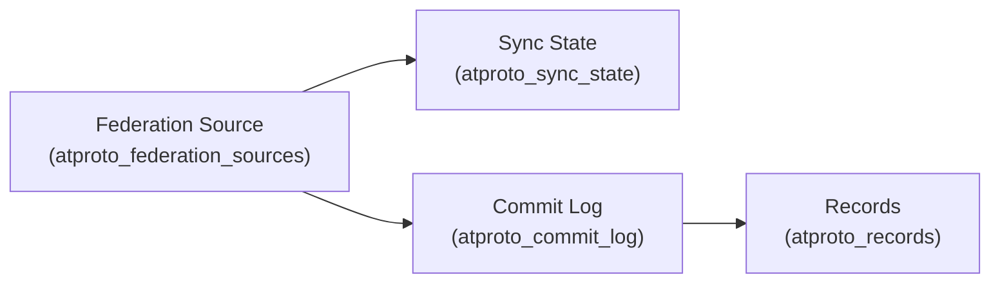

# AT Protocol Federation & Sync State Models (Phase 1.3)

This document defines SocialSim's **data-only** models for federation and synchronization.

> Scope: Persist remote source metadata, sync cursors/checkpoints, and commit/event log storage. No networking, ingestion, or sync protocol implementation in Phase 1.3.

## Goals

- Represent external sources (PDS/AppView/other) and their trust/safety policies.
- Persist sync state/cursors to support resumable ingestion.
- Persist an append-only commit log for auditability.

## External instance references

### Federation sources

A federation source represents a remote origin for commits / records.

**Examples**

- A PDS endpoint: `https://pds.example.com`
- An AppView endpoint: `https://appview.example.com`

**Stored in:** `atproto_federation_sources`

Key fields:

- `kind`: `PDS | AppView | Other`
- `service_endpoint`: base URL
- `is_enabled`: operational toggle
- `trust_policy` (modeled via fields): allow/deny, reason, rate limit
- `metadata` JSONB: free-form structured metadata (software, version, headers, notes)

## Sync cursors / checkpoints

**Stored in:** `atproto_sync_state`

Key fields:

- `(source_id, did)` uniqueness: one cursor per source per repo (or global if `did` is null)
- Cursor fields (data-only):
  - `cursor` (opaque string)
  - `last_seq` (monotonic sequence, if available)
  - `last_success_at`, `last_attempt_at`, `next_attempt_at`
  - `failure_count`, `failure_reason`

## Event log / commit log model

**Stored in:** `atproto_commit_log`

- Append-only rows representing commits received from a source.
- `operations` JSONB includes a list of actions:
  - `create | update | delete`
  - `collection_nsid`, `rkey`, `cid`



## Trust / safety metadata (data fields)

Phase 1.3 models trust and safety controls as both:

- **Configuration** (future): allow/deny lists and rate limits are controlled via appsettings.
- **Persisted audit fields** (now): `atproto_federation_sources` stores the effective policy fields used for a run.

Recommended modeled fields:

- `allow_ingest` (bool)
- `deny_reason` (text)
- `rate_limit_per_minute` (int)

## Example records

### Example: federation source

```json
{
  "id": "c0a8012e-0000-0000-0000-000000000001",
  "kind": "PDS",
  "name": "Example PDS",
  "serviceEndpoint": "https://pds.example.com",
  "isEnabled": true,
  "allowIngest": true,
  "rateLimitPerMinute": 600,
  "metadata": {
    "software": "pds",
    "notes": "Seeded for simulation run"
  }
}
```

### Example: sync state

```json
{
  "sourceId": "c0a8012e-0000-0000-0000-000000000001",
  "did": "did:plc:abc123example",
  "status": "Active",
  "cursor": "opaque-cursor-string",
  "lastSeq": 12345,
  "lastSuccessAt": "2025-12-31T00:30:00Z",
  "failureCount": 0,
  "failureReason": null
}
```

### Example: commit log entry

```json
{
  "sourceId": "c0a8012e-0000-0000-0000-000000000001",
  "did": "did:plc:abc123example",
  "seq": 12346,
  "commitCid": "bafyreibatchcommit",
  "prevCid": "bafyreibatchcommitprev",
  "operations": [
    {"action": "create", "collectionNsid": "app.bsky.feed.post", "rkey": "3k3l2...", "cid": "bafyreipost"}
  ],
  "receivedAt": "2025-12-31T00:30:05Z",
  "status": "Received"
}
```

## Validation rules & constraints

- `service_endpoint` must be a valid absolute URL (validated later).
- `(source_id, did)` is unique for sync state.
- `seq` should be non-decreasing per `(source_id, did)` (enforced later; indexed now).
- Commit log is append-only by convention.

## Open questions / decisions

- Should sync state be per-collection (more granular) instead of per-repo?
- Should commit log retention be bounded by policy (and where is the retention policy stored)?
- Do we need a separate table for per-source public keys / signing metadata at this phase?
