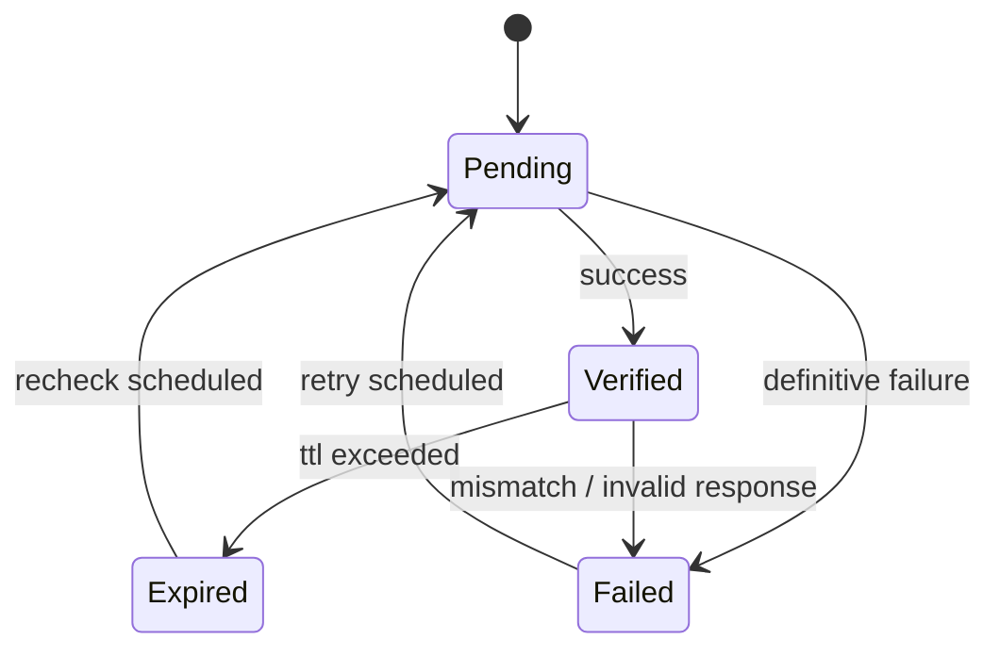

# AT Protocol Handle Resolution & Verification Model (Phase 1.3)

This document defines the **data model** for handle → DID resolution and verification in SocialSim.

> Scope: Persisting resolution inputs/outputs, caching fields, and a verification state machine. No DNS/HTTPS resolution logic is implemented in Phase 1.3.

## Goals

- Model multiple resolution methods (DNS TXT and HTTPS well-known).
- Provide an auditable verification state machine with retry/backoff metadata.
- Support multi-domain simulated handles via `ATProtocolOptions.HandleFormat`.

## Handle → DID sources

### 1) DNS TXT

- TXT record name: `_atproto.<handle>`
- TXT record value: `did=<did>`

Example (conceptual):

- Name: `_atproto.alice.theanarchox.net`
- Value: `did=did:plc:abc123...`

### 2) HTTPS well-known

- URL: `https://<handle>/.well-known/atproto-did`
- Body: DID string (e.g., `did:plc:abc123...`)

## Data model overview

### Core tables

- `atproto_identities`: canonical DID identity row.
- `atproto_handles`: handle rows (many per DID, one primary).

### Recommended cache/verification fields

`atproto_handles` persists:

- `verification_method` (`DnsTxt` / `WellKnown`)
- `verification_status` (`Pending` / `Verified` / `Expired` / `Failed`)
- `ttl_seconds` (cache TTL derived from DNS or policy)
- `last_checked_at`, `next_check_at`
- `attempt_count`, `consecutive_failure_count`
- `last_failure_code`, `last_failure_reason`

## Verification state machine



### State semantics

- **Pending**: verification requested but not confirmed.
- **Verified**: latest check confirmed handle ↔ DID mapping.
- **Expired**: previously verified, but TTL elapsed without revalidation.
- **Failed**: last attempt failed; may be retried based on policy.

## Multi-domain + handle generation (simulated agents)

SocialSim already includes:

- `ATProtocolOptions.CustomDomain`
- `ATProtocolOptions.HandleFormat` (e.g., `{username}.theanarchox.net`)

**Model-level constraints**

- Simulation-generated handles must be deterministic given:
  - simulation seed
  - agent identifier
  - `HandleFormat` and domain configuration

**Recommended persisted audit fields**

- `atproto_identities.metadata.generation.handleFormat`
- `atproto_identities.metadata.generation.customDomain`
- `atproto_identities.metadata.generation.seed`

## Validation rules & constraints

- `handle` must be normalized to lowercase and unique.
- A DID may have multiple handles, but only one **primary** handle.
- `verification_status` drives whether a handle is considered authoritative.
- If `verification_status = Verified`, `last_checked_at` should be non-null.

## Example records

### Example: `atproto_handles` row (JSON shape)

```json
{
  "handle": "alice.theanarchox.net",
  "did": "did:plc:abc123example",
  "isPrimary": true,
  "verificationMethod": "DnsTxt",
  "verificationStatus": "Verified",
  "ttlSeconds": 3600,
  "lastCheckedAt": "2025-12-31T00:10:00Z",
  "nextCheckAt": "2025-12-31T01:10:00Z",
  "attemptCount": 3,
  "consecutiveFailureCount": 0,
  "lastFailureCode": null,
  "lastFailureReason": null
}
```

### Example: verification failure

```json
{
  "handle": "alice.theanarchox.net",
  "did": "did:plc:abc123example",
  "verificationMethod": "WellKnown",
  "verificationStatus": "Failed",
  "lastCheckedAt": "2025-12-31T00:12:00Z",
  "attemptCount": 5,
  "consecutiveFailureCount": 2,
  "lastFailureCode": "HttpNot200",
  "lastFailureReason": "GET /.well-known/atproto-did returned 404"
}
```

## Open questions / decisions

- Should SocialSim persist both DNS and well-known results simultaneously (two rows per handle), or pick a priority order and only persist the chosen method?
- What is the canonical TTL policy for HTTPS well-known (fixed TTL vs derived from cache headers)?
- Should domain allow/deny policies live only in configuration, or also be persisted for audit/replay?
