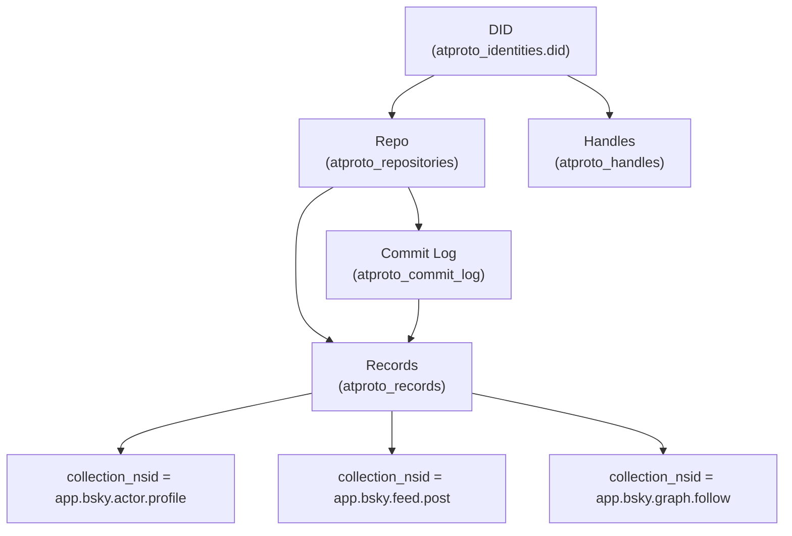

# AT Protocol Primitives Mapping (Phase 1.3)

This document defines how SocialSim **models and persists** AT Protocol primitives (DID/handle/repo/records/CIDs) while staying compatible with existing Phase 1.1–1.2 domain models.

> Scope: **data models + schemas + serialization contracts**. No PDS/AppView networking or resolution logic is implemented in Phase 1.3.

## Goals

- Represent AT Protocol primitives explicitly and durably: **DID**, **handle**, **repository**, **record**, **rkey**, **CID**.
- Keep simulation-generated identities **deterministic** given config + seed (store algorithm/version metadata).
- Keep verification and sync states **queryable and auditable**.
- Allow new collections / record types without schema migrations (JSONB + schema registry).

## Supported Identifiers

### DIDs

**Supported DID methods (Phase 1.3 modeling):**

- `did:plc:<id>` (primary)
- `did:web:<domain>` (modeled for future use)

**Storage rule:** SocialSim stores a DID as a **normalized lowercase string** (ASCII) in `atproto_identities.did`.

**Normalization (model-level contract):**

- Trim surrounding whitespace.
- Lowercase the DID string.
- Reject embedded spaces.

**Uniqueness:**

- `atproto_identities.did` is globally unique.

### Handles

Handles are stored without the leading `@`.

**Examples**

- `alice.bsky.social`
- `alice.theanarchox.net` (custom domain)

**Normalization (model-level contract):**

- Trim surrounding whitespace.
- Lowercase.
- Reject spaces.
- No trailing dot.

**Uniqueness:**

- `atproto_handles.handle` is globally unique (one handle resolves to one DID at a time).

### Relationship to existing domain fields

Existing domain model fields remain unchanged:

- `SocialSim.Core.Models.SocialAgent.DecentralizedId` (string?)
- `SocialSim.Core.Models.SocialAgent.Handle` (string?)
- `SocialSim.Core.Models.Post.RecordKey` (string?)
- `SocialSim.Core.Models.Post.ContentId` (string?)

**Compatibility boundary:**

- The authoritative AT identity data for simulation runs is modeled in `AtProtoIdentity` / `atproto_*` tables.
- `SocialAgent.DecentralizedId` and `SocialAgent.Handle` remain as convenience fields and/or a denormalized view.

## Repository & Records

### AT Protocol concepts

- **Repo**: logical repository for a DID.
- **Collection**: namespace identifier (NSID) representing a record collection (e.g., `app.bsky.feed.post`).
- **Record**: JSON object with `$type` and collection-defined fields.
- **rkey**: record key within a collection.
- **CID**: content-addressed hash of the record payload.

### SocialSim mapping

| AT concept | SocialSim storage | Notes |
|---|---|---|
| DID | `atproto_identities.did` | Primary key for repo and records |
| Handle(s) | `atproto_handles` | Multiple handles per DID; one marked primary |
| Repo metadata | `atproto_repositories` | Per-DID repo state; endpoints and head info |
| Collection NSID | `atproto_records.collection_nsid` | String (no enum) for extensibility |
| Record (payload) | `atproto_records.payload` (JSONB) | Raw record JSON; validated later |
| rkey | `atproto_records.rkey` | Unique per (did, collection) |
| CID | `atproto_records.cid` | Stored string; format validated later |
| Record lifecycle | `atproto_records` + `atproto_commit_log` | Commit log provides audit trail |

### Structural diagram



## Lexicon Compatibility (Model-Level)

Phase 1.3 introduces a **schema registry** model to support lexicon-like validation without implementing a full lexicon validator.

### Approach

- Store lexicon-like schemas in `atproto_lexicon_schemas` keyed by `(nsid, version)`.
- Store records in `atproto_records.payload` as JSONB.
- Store record routing metadata in columns:
  - `collection_nsid` (NSID)
  - `record_type` (typically equals `$type`)

### Validation contract (future implementation)

A future validator will:

1. Verify `$type` exists and matches expected lexicon schema.
2. Validate required fields and types.
3. Enforce maximum sizes (text length, array lengths, blob refs).

**Phase 1.3 requirement:** data fields exist to persist results and support audits; validation itself is out-of-scope.

## Versioning & Evolution

### Record definition versioning

- Each lexicon schema has:
  - `nsid` (e.g., `app.bsky.feed.post`)
  - `version` (semver-like string; e.g., `1.0.0`)
  - `schema` (JSON)
  - `is_active` flag (exactly one active schema per NSID)

### Storage evolution

- Tables are additive and use JSONB for payloads.
- Breaking schema changes should be represented as a **new schema version**; records remain raw JSONB.
- Database migrations are still required for changes to indexed columns or constraints.

### Determinism and traceability

For simulation-generated AT data, SocialSim should persist the following metadata fields (Phase 1.3 data modeling):

- Identity generation: `atproto_identities.metadata.generation` (algorithm name + version + seed inputs)
- rkey generation: `atproto_records.payload._socialsim.generation` (algorithm + version)
- CID generation: `atproto_records.payload._socialsim.cid` (hash algorithm + version)

> Note: generation algorithms are not implemented in Phase 1.3; this is the intended audit surface.

## Example payloads

### Example: Profile record (`app.bsky.actor.profile`)

```json
{
  "$type": "app.bsky.actor.profile",
  "displayName": "Alice Agent",
  "description": "Simulated account",
  "avatar": {
    "$type": "blob",
    "ref": {"$link": "bafkreiexample"},
    "mimeType": "image/png",
    "size": 12345
  },
  "_socialsim": {
    "generation": {
      "algorithm": "ProfileV1",
      "version": "1.0.0",
      "seed": "run-seed-placeholder"
    }
  }
}
```

### Example: Post record (`app.bsky.feed.post`)

```json
{
  "$type": "app.bsky.feed.post",
  "text": "Hello from SocialSim.",
  "createdAt": "2025-12-31T00:00:00Z",
  "langs": ["en"],
  "facets": [],
  "_socialsim": {
    "generation": {
      "algorithm": "PostTextV1",
      "version": "1.0.0"
    }
  }
}
```

### Example: Follow record (`app.bsky.graph.follow`)

```json
{
  "$type": "app.bsky.graph.follow",
  "subject": "did:plc:z72i7hdynmk6r22z27h6tvur",
  "createdAt": "2025-12-31T00:00:10Z"
}
```

## Validation rules & constraints (Phase 1.3)

- `did` is unique and normalized to lowercase.
- `handle` is unique and normalized to lowercase.
- `collection_nsid` is required for records and should be a valid NSID (validated later).
- `rkey` is required for records and unique per `(did, collection_nsid)`.
- `cid` is required for records; format validated later.

## Open questions / decisions

- Should SocialSim enforce case-insensitive uniqueness at the DB layer using `CITEXT`, or rely on model-level normalization?
- Do we want record history in a separate `atproto_record_versions` table, or is `atproto_commit_log` sufficient?
- Should `SocialAgent.DecentralizedId/Handle` be treated as a cache of the primary AT identity, or allow divergence for hybrid agents?
