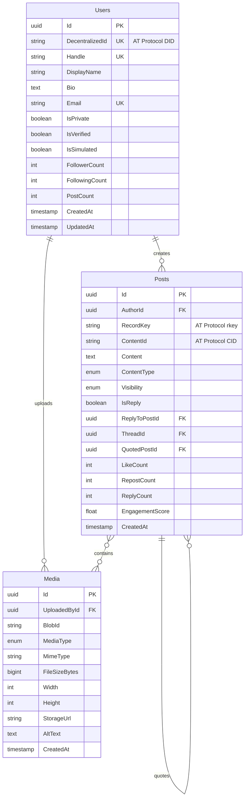
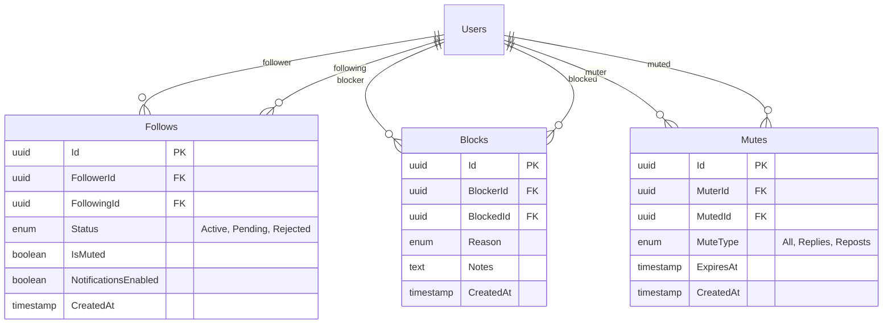
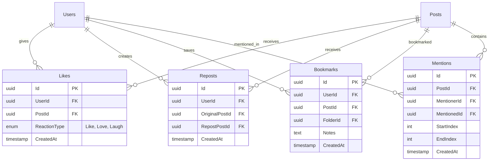
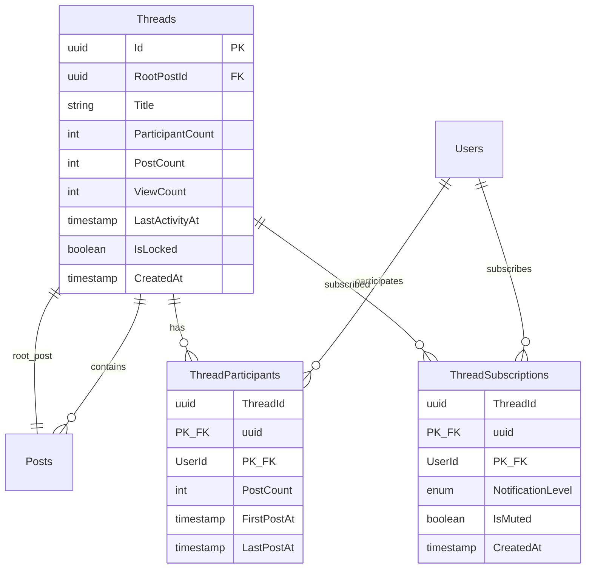
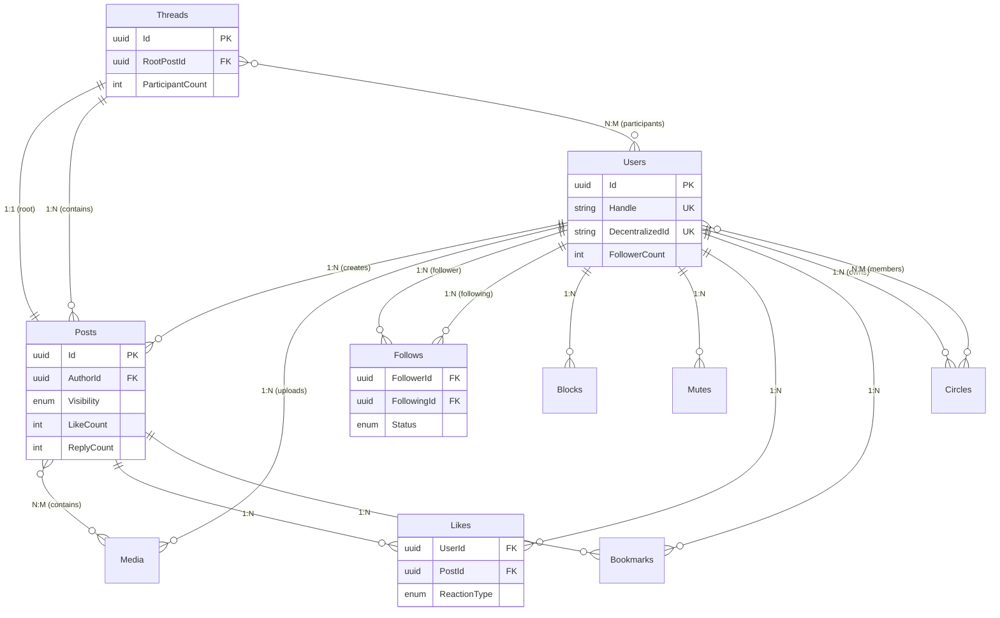
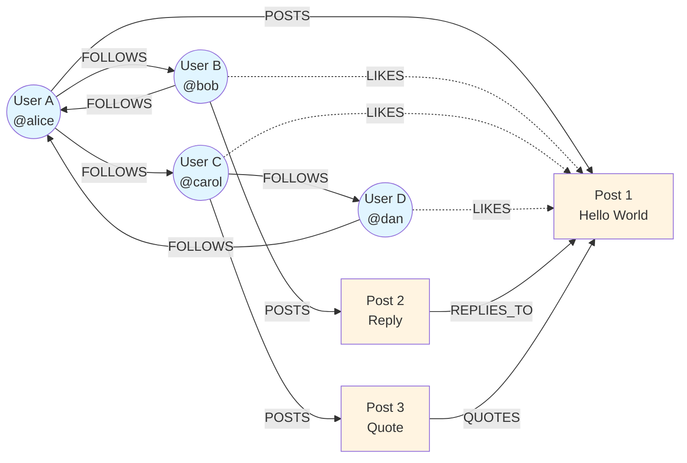
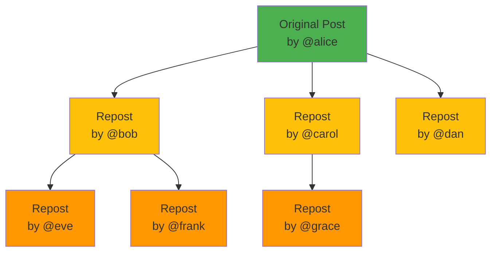
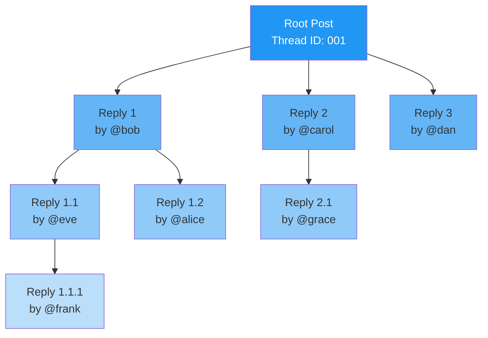
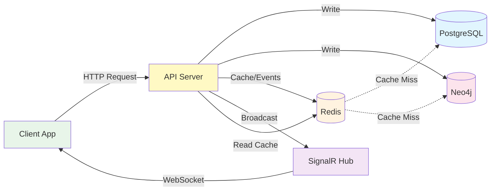
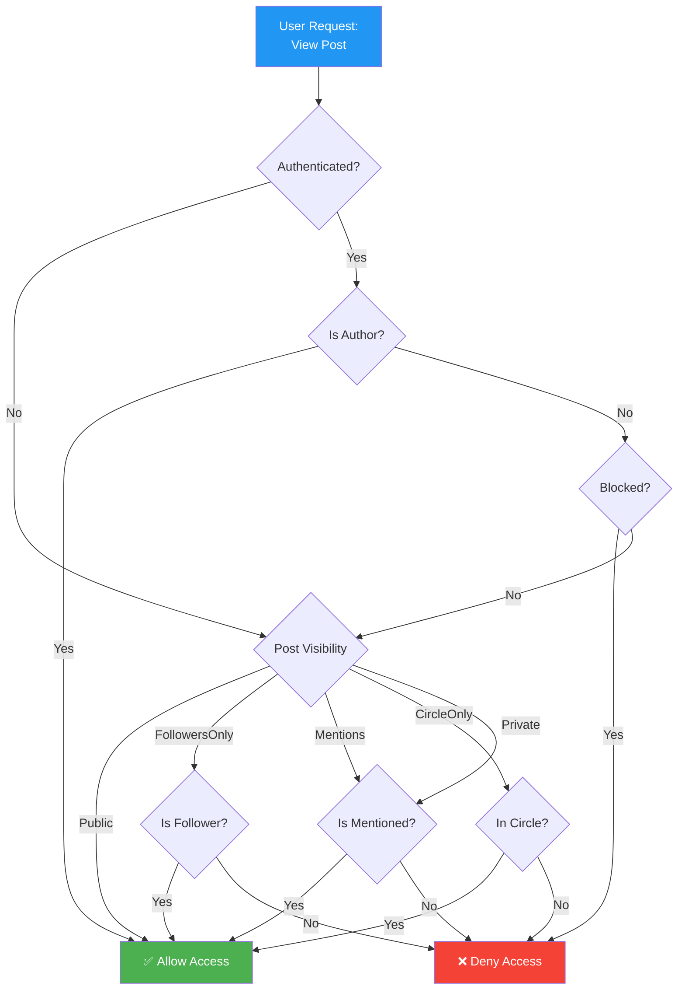

# Visual ERD - Mermaid Diagrams

This document contains interactive ERD diagrams using Mermaid.js syntax that can be rendered in GitHub, VS Code, and other Markdown viewers.

## Core Entities Diagram

### Users and Posts



---

## Social Relationships Diagram



---

## Engagement System Diagram



---

## Thread System Diagram



---

## Privacy & Circles Diagram

```mermaid
erDiagram
    Users ||--o{ Circles : owns
    Circles ||--o{ CircleMembers : contains
    Users ||--o{ CircleMembers : member_of
    Users ||--|| UserSettings : has_settings
    Users ||--|| UserContentFilters : has_filters
    
    Circles {
        uuid Id PK
        uuid OwnerId FK
        string Name
        text Description
        string Color
        int MemberCount
        timestamp CreatedAt
    }
    
    CircleMembers {
        uuid CircleId PK_FK
        uuid MemberId PK_FK
        timestamp AddedAt
    }
    
    UserSettings {
        uuid UserId PK_FK
        enum DefaultPostVisibility
        boolean AllowFollowRequests
        enum AllowMentions
        enum AllowDirectMessages
        boolean ShowFollowers
        boolean ShowFollowing
        timestamp UpdatedAt
    }
    
    UserContentFilters {
        uuid UserId PK_FK
        boolean HideNSFW
        boolean HideViolence
        boolean HideSpoilers
        boolean BlurSensitiveMedia
        timestamp UpdatedAt
    }
```

---

## Complete System Overview



---

## Neo4j Graph Visualization

### Social Network Graph



### Engagement Cascade



---

## Thread Structure Visualization



---

## Data Flow Diagram



---

## Visibility & Access Control Flow



---

## Rendering Instructions

### In VS Code

1. Install "Markdown Preview Mermaid Support" extension
2. Open this file in preview mode (Ctrl+Shift+V)
3. Diagrams will render automatically

### In GitHub

1. GitHub natively supports Mermaid diagrams
2. View this file on GitHub to see rendered diagrams

### In Documentation Sites

1. **MkDocs**: Use `mkdocs-mermaid2-plugin`
2. **Docusaurus**: Supports Mermaid out of the box
3. **GitBook**: Use Mermaid plugin

### Export to Image

Use [Mermaid Live Editor](https://mermaid.live) to export as PNG/SVG.

---

## Interactive Exploration

For interactive exploration of the data model:

1. **Neo4j Browser**: Load sample graph data and explore visually
2. **DBeaver**: Connect to PostgreSQL and auto-generate ERD
3. **dbdiagram.io**: Import schema and create collaborative diagrams

See [sample-data.md](./sample-data.md) for seed data to populate databases.
