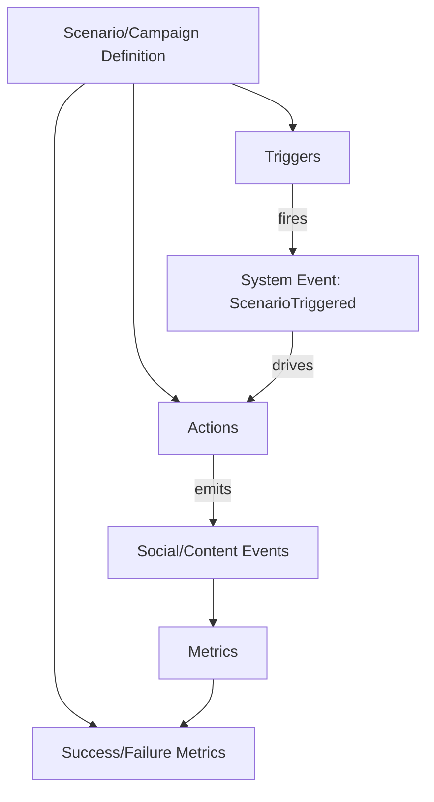

# Scenarios & Campaigns Model Specification

This document defines data models for **scenarios** (viral events, crises, interventions) and **campaigns** (marketing/promoted content) for SocialSim (Phase 1.2).

> These models define structure and serialization formats only; execution belongs to Phase 4.

## Goals

- Configurable without code changes (YAML/JSON)
- Deterministic and reproducible given seed + run configuration
- Expressive enough to model Phase 4.5 scenarios (viral, marketing, misinformation, bot networks)
- UI-friendly: easy to query status, triggers, progress, and outcomes

---

## 1. Core Concepts

- **Scenario**: a bounded, named set of triggers and actions.
- **Campaign**: a scenario subtype with budget/targeting constraints and measurement goals.
- **Trigger**: when something should start (time, metric threshold, topic trend, external injection).
- **Action**: what should happen (seed content, activate cohort, change parameters, inject bots).



---

## 2. Scenario Model

### 2.1 Scenario Fields

- `id`: UUID
- `name`: string
- `scenarioType`: Viral | Marketing | Crisis | Custom
- `version`: string
- `enabled`: bool
- `description`: string
- `triggers`: list of trigger specifications
- `actions`: list of action specifications
- `metrics`: success/failure measurement rules
- `constraints`: guardrails (rate limits, max affected agents)

### 2.2 Viral Event Configuration

**Purpose**: seed content and drive spread.

Key fields:
- `seedAgentSelection`: criteria (by influence percentile, community membership, interest match)
- `contentTemplate`: rules for generated content (topic, tone, media)
- `spreadParameters`: velocity multipliers, adoption probabilities, saturation thresholds
- `viralThreshold`: definition of what “viral” means (views, repost rate, topic adoption)

### 2.3 Crisis Simulation Configuration

**Purpose**: misinformation spread, coordinated behavior, counter-messaging.

Key fields:
- `misinformationTemplates`: content patterns
- `botNetwork`: size, creation pattern, coordination strategy
- `coordinationRules`: synchronized posting windows, target selection
- `counterMessaging`: injected correction messages, moderation actions

---

## 3. Campaign Model (Marketing)

### 3.1 Campaign Fields

- `id`: UUID
- `name`: string
- `campaignType`: PromotedPost | InfluencerActivation | ABTest
- `start`: trigger spec (often time-based)
- `end`: time or budget-limited
- `targetAudience`: criteria
- `promotedContent`: template/spec
- `budget`: currency + limits
- `impressionLimits`: max impressions per user / per hour
- `abTest`: variants + allocation

### 3.2 Audience Targeting Criteria (Examples)

- Interest match (topic weights)
- Locale/timezone
- Follower count ranges (micro vs macro)
- Opinion ranges (dimension constraints)
- Community membership (Neo4j-derived)

---

## 4. Optional Scenario DSL (YAML)

A compact, UI-editable schema that can be stored in PostgreSQL as JSONB.

### 4.1 Schema Shape (Conceptual)

- `triggers[]`: `{ type, parameters }`
- `actions[]`: `{ type, parameters }`
- `metrics[]`: `{ type, parameters }`

### 4.2 Example: Viral Meme Scenario

```yaml
name: "meme-drop"
version: "1.0"
scenarioType: "Viral"
enabled: true
triggers:
  - type: "AtTick"
    parameters:
      tick: 600
actions:
  - type: "SeedPost"
    parameters:
      topic: "ai"
      tone: "Humorous"
      mediaType: "Image"
      seedAgents:
        selection: "TopInfluencePercentile"
        percentile: 2
      spread:
        adoptionMultiplier: 1.35
        echoChamberBoost: 1.15
        saturation:
          maxAdoptionRate: 0.62
metrics:
  - type: "TopicAdoption"
    parameters:
      topic: "ai"
      successThreshold: 0.35
      windowTicks: 7200
constraints:
  maxAffectedAgents: 50000
  maxPostsInjected: 200
```

### 4.3 Example: Marketing A/B Test Campaign

```yaml
name: "promo-abtest-001"
version: "1.0"
scenarioType: "Marketing"
enabled: true
triggers:
  - type: "AtTimeUtc"
    parameters:
      timestampUtc: "2026-01-01T01:00:00Z"
actions:
  - type: "RunCampaign"
    parameters:
      campaignType: "ABTest"
      targetAudience:
        interestsAny: ["sports", "fitness"]
        followerCount:
          min: 50
          max: 5000
      budget:
        currency: "USD"
        total: 2500
      variants:
        - id: "A"
          contentTemplate:
            text: "New gear drop — limited run."
            tone: "Neutral"
        - id: "B"
          contentTemplate:
            text: "Level up your training — limited run."
            tone: "Positive"
      allocation:
        A: 0.5
        B: 0.5
metrics:
  - type: "EngagementRateLift"
    parameters:
      baseline: "historical"
      minLift: 0.05
      windowTicks: 14400
```

---

## 5. Validation Rules

- `name` + `version` must be unique per scenario/campaign.
- Trigger/action types must be from a known registry (or `Custom` with schema).
- Budget totals must be $\ge 0$.
- A/B allocations must sum to 1.0.
- Guardrails must prevent runaway injection (caps on posts, affected agents).

---

## 6. Open Questions

1. Should campaigns be represented as a special `Scenario` type in storage, or separate tables (current plan: separate for clarity)?
2. Do we need a first-class notion of “intervention” (moderation/counter-messaging) separate from scenarios?
