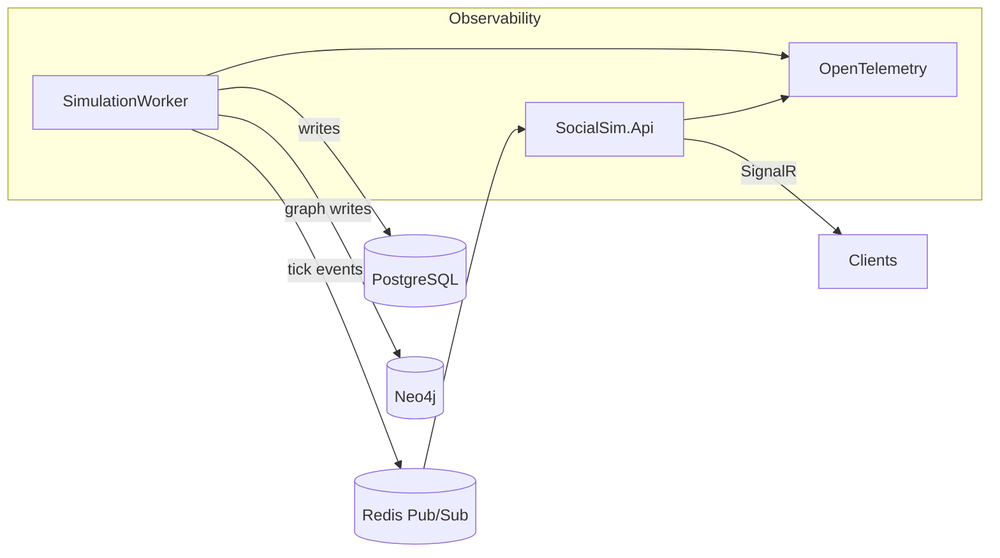
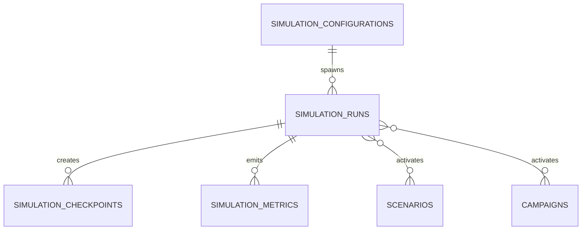
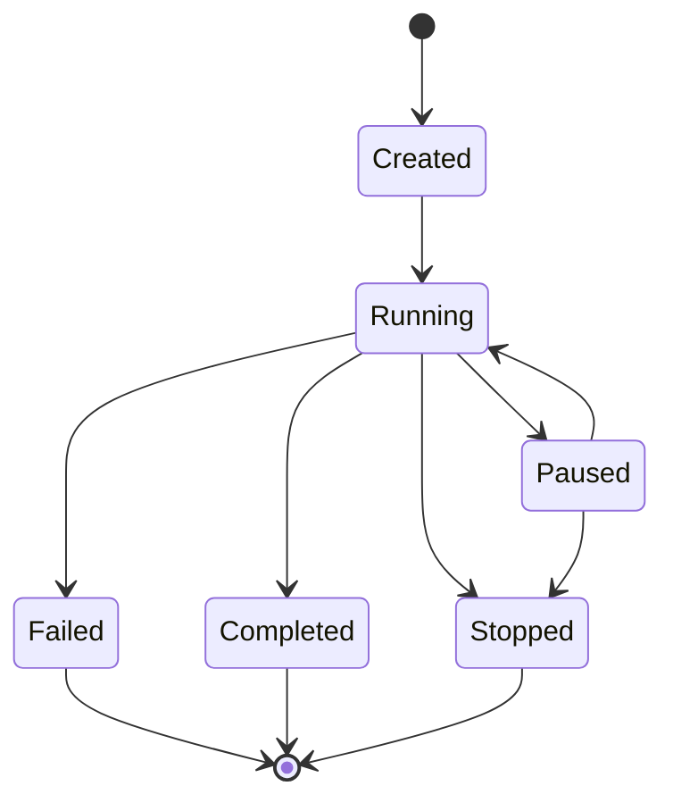

# Simulation State Model Specification

This document defines the **simulation configuration**, **runtime state**, **metrics**, and **checkpointing** models for SocialSim (Phase 1.2). These are **data models only** (no simulation algorithms).

## Goals

- **Probabilistic**: behaviors are parameterized by distributions.
- **Configurable**: all parameters can be modified without code changes (JSON/YAML-driven).
- **Reproducible**: same `seed + configuration` produces the same event stream.
- **Observable**: every decision point can be traced to config + tick + causal chain.
- **Performant**: supports 100K+ concurrent agents; O(1) state updates per agent per tick.
- **Extensible**: add new metrics, termination rules, and topology parameters without schema churn.

---

## 1. High-Level Architecture



---

## 2. Core Concepts

### 2.1 Simulation Configuration vs Run

- **Configuration**: a reusable, versioned template describing *what to run*.
- **Run**: a single execution instance of a configuration (with status, time, checkpoints, metrics).



---

## 3. Simulation Configuration Model

### 3.1 Time Model

The simulation clock is represented as discrete **ticks**.

- `tick`: monotonic integer $\ge 0$
- `simulatedTimeUtc`: derived as `startTimeUtc + tick * tickDuration`

#### Time Scale
- `RealTime`: tick duration equals wall clock duration.
- `Accelerated`: tick duration is smaller or larger than wall clock; mapping determined by `accelerationFactor`.
- `StepByStep`: manual advancement (useful for debugging/demo).

### 3.2 Population Model

Population configuration describes how agents are created:

- `agentCount`: target agent count.
- `traitDistributions`: distribution specs for `AgentPersonality`, `ActivityPattern`, `ContentPreferences`, plus base `AgentBehavior`.
- `cohorts`: named sub-populations with different parameter sets.

### 3.3 Network Topology Seed

Initial social graph generation strategy:

- `Random`: Erdős–Rényi-ish (`p` connect probability, min/max degree caps)
- `ScaleFree`: preferential attachment (`m` edges per new node, initial clique size)
- `SmallWorld`: Watts–Strogatz (`k` nearest neighbors, `rewireProb`)

> Storage note: topology **parameters** belong in PostgreSQL configuration; topology **relationships** belong in Neo4j.

### 3.4 Termination Conditions

Runs may terminate when any condition is met:

- `maxTicks`
- `maxWallClockDuration`
- `maxSimulatedDuration`
- `targetEventCount` (optional)
- `custom` (typed name + parameters)

### 3.5 Example Configuration (JSON)

```json
{
  "name": "baseline-100k-smallworld",
  "version": "1.0",
  "seed": 123456789,
  "time": {
    "mode": "Accelerated",
    "tickDurationMs": 250,
    "accelerationFactor": 20,
    "startTimeUtc": "2026-01-01T00:00:00Z"
  },
  "population": {
    "agentCount": 100000,
    "cohorts": [
      {
        "name": "creators",
        "weight": 0.08,
        "overrides": {
          "behavior": { "postingFrequency": 0.85, "engagementRate": 0.65, "influenceScore": 0.55 },
          "contentPreferences": { "contentLength": { "meanChars": 240, "stdDevChars": 90 } }
        }
      },
      {
        "name": "lurkers",
        "weight": 0.55,
        "overrides": { "behavior": { "postingFrequency": 0.15, "engagementRate": 0.40 } }
      }
    ]
  },
  "topology": {
    "mode": "SmallWorld",
    "parameters": { "k": 12, "rewireProb": 0.08 }
  },
  "termination": {
    "maxTicks": 288000,
    "maxWallClockDuration": "02:00:00"
  }
}
```

### 3.6 Validation Rules

- `seed` must be present and stable for reproducibility.
- `tickDurationMs` must be $> 0$.
- `agentCount` must be $> 0$.
- Cohort `weight` values must sum to $\le 1.0$ (remaining weight uses baseline distribution).
- Topology parameters must be within safe bounds (e.g., `k >= 2`, `0 <= rewireProb <= 1`).

---

## 4. Simulation Run State Model

A run tracks current status and progress:

- `status`: Created | Running | Paused | Stopped | Completed | Failed
- `currentTick`
- `currentSimulatedTimeUtc`
- `activeAgentCount` (computed)
- `scenarioStates` / `campaignStates`
- `lastError` (if failed)

### 4.1 Run Lifecycle



---

## 5. Metrics Model

### 5.1 Real-Time Metrics

Metrics are sampled per tick or per time bucket.

**Core metrics**:
- Active agent count
- Posts per minute/hour
- Engagement rates (likes/reposts/replies per post)
- Network metrics: density, clustering coefficient, approximate diameter
- Sentiment distribution (mean/variance; optional histogram buckets)
- Trending topics (top-k with weights)

**Performance guidance**:
- Prefer **time-bucketed** sampling (e.g., every 5s/30s) for heavy metrics.
- Store large structures (histograms, top-k topics) in `JSONB`.

### 5.2 Metrics Example (JSON)

```json
{
  "runId": "c4a6b0f5-3a89-4f48-a113-5e3d0b5d3a8e",
  "tick": 12000,
  "observedAtUtc": "2026-01-01T00:50:00Z",
  "activeAgents": 73421,
  "postsCreated": 982,
  "engagements": { "likes": 6400, "reposts": 420, "replies": 900, "quotes": 80 },
  "network": { "density": 0.000012, "clustering": 0.18, "approxDiameter": 11 },
  "sentiment": { "mean": 0.12, "stdDev": 0.41, "histogram": { "-1..-0.5": 8200, "-0.5..0": 21000, "0..0.5": 36000, "0.5..1": 8200 } },
  "trendingTopics": [
    { "topic": "ai", "score": 0.91 },
    { "topic": "soccer", "score": 0.66 }
  ]
}
```

### 5.3 Validation Rules

- Counters must be $\ge 0$.
- Histogram buckets must sum to `activeAgents` if representing agent sentiment at sample time.

---

## 6. Historical Snapshots & Checkpoints

### 6.1 Checkpoint Objectives

- **Restore**: roll back a run to a prior tick.
- **Audit**: enable reproducible replay.
- **Diff-friendly**: support incremental storage for efficiency.

### 6.2 Checkpoint Storage Model

A checkpoint stores:
- `runId`, `tick`
- `format`: Json | MessagePack | Custom
- `statePointer`: storage URI / blob id
- `checksum`: integrity validation
- `diffFromCheckpointId` (optional)

### 6.3 Serialization Format

Recommended approach:
- Store a small structured row in PostgreSQL.
- Store heavy payload (full state/diff) in object storage or Postgres large object.

---

## 7. Open Questions

1. Should we persist full agent state in checkpoints, or rehydrate from events + DB state?
2. Do we require deterministic ordering guarantees across distributed workers (single-writer vs sharded simulation)?
3. What level of fidelity is required for network metrics (exact vs approximate)?
